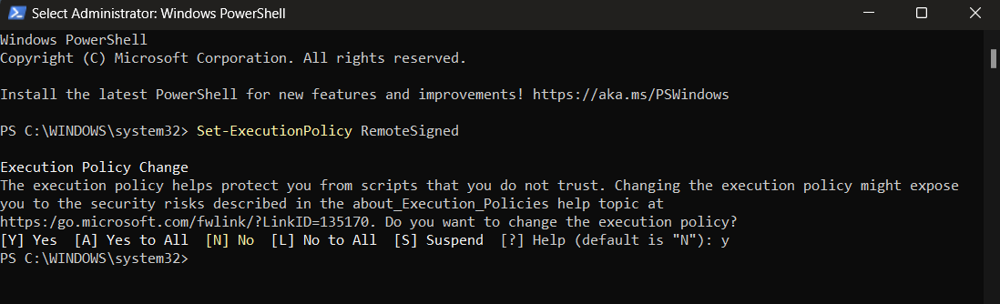

# Horizon-API-Redeploy
  This repository is your go-to resource for efficiently managing and updating the API component of Horizon, the web-based user interface for OpenStack, ensuring seamless interaction with your cloud infrastructure.
## Setup
- Build virtual environment
  `python -m venv redeployhorizon`
- active virtual environment
  
  `.\redeployhorizon\Scripts\activate`
- install django
  `pip install django`

